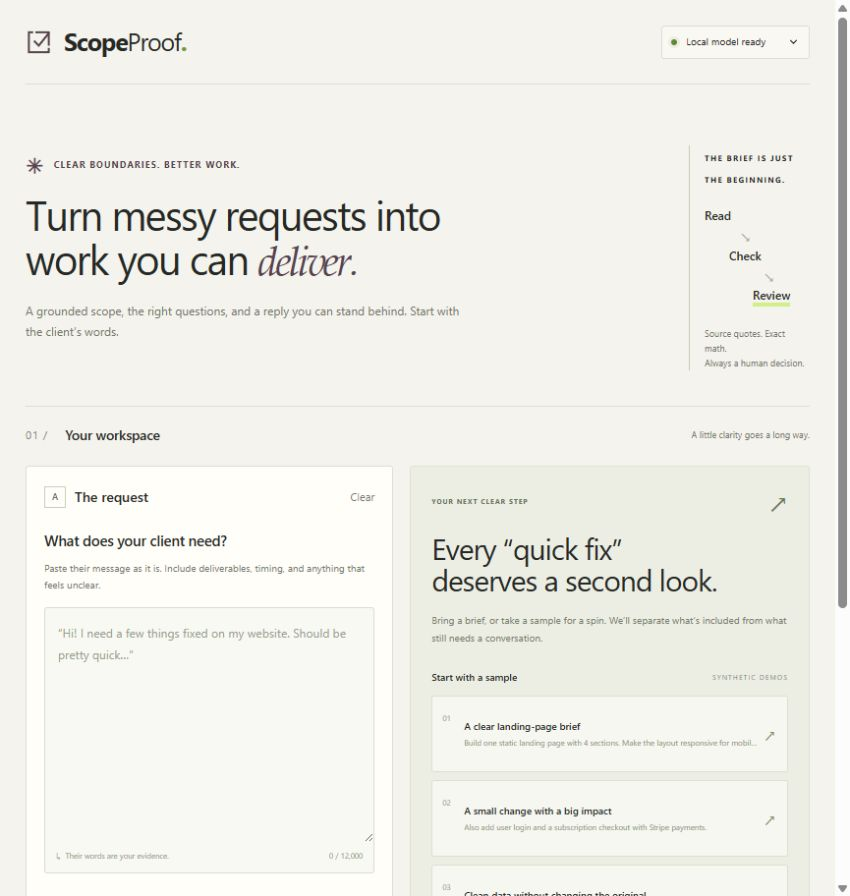
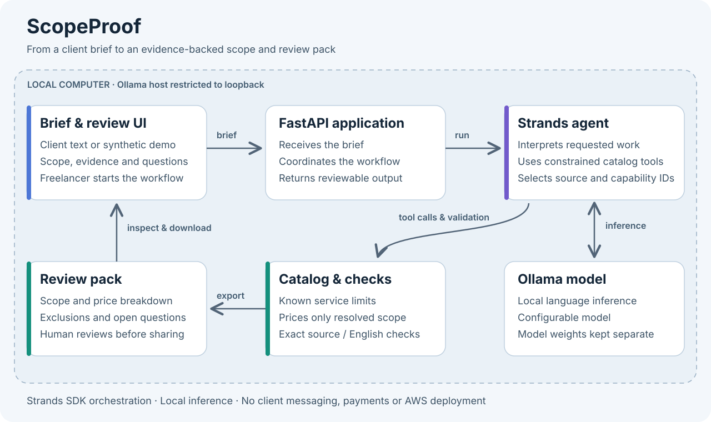

# ScopeProof

**Turn a messy client brief into a scope you can explain.**

ScopeProof is a local agent for freelance developers who sell fixed-scope services. It turns a brief and a small synthetic service catalog into a review pack: proposed work, exact source statements, exclusions, open questions and a catalog-based sample estimate when the scope is clear.

This project began on **13 September 2026** for the **Professional Agents** track of Agents for Humans. The source, interface and synthetic examples are new work created with AI coding assistance. The local prototype has been installed, tested and exercised with real Strands/Ollama runs; the observed results and remaining publication steps are recorded below.



## The workflow

1. Paste a client brief or choose a clearly marked synthetic example.
2. Run the Strands agent against the supplied service catalog, optionally adding a change request.
3. Review which requested work fits, which requests exceed the offer and which questions remain unanswered.
4. Check each source quote and review the sample price or the reasons a price was withheld.
5. Select **Export review pack**, inspect the ZIP and decide what to share with the client.

The agent prepares a scope; it does not perform the development work described by that scope. The freelancer retains responsibility for any client commitment. ScopeProof does not contact clients, submit proposals, charge money or buy services.

The catalog contains four illustrative services: a static landing page (USD 120), one Node.js API endpoint (USD 90), a small CSV cleanup (USD 60) and an approved FAQ widget (USD 110). These are synthetic prices, not published marketplace offers. The compiler assigns a total only when exactly one service is supported and every source statement and prerequisite is resolved. Excluded work, uncertain wording, mixed services or a change request leave the result unpriced.

## Run locally

These instructions target Python 3.12 and a local Ollama installation. Run commands from the repository root. The editable installation was verified in a fresh Windows virtual environment. macOS/Linux commands are provided for the same setup but have not been separately tested.

Install [Ollama](https://ollama.com/download), start it and download [qwen3:4b-instruct](https://ollama.com/library/qwen3:4b-instruct). The model uses Apache 2.0 terms separately from this repository's MIT license. Model weights and any locally downloaded Ollama executable are not bundled with this project.

Windows PowerShell:

```powershell
py -3.12 -m venv .venv
.\.venv\Scripts\python.exe -m pip install -e ".[dev]"
ollama pull qwen3:4b-instruct
$env:SCOPEPROOF_MODEL = "qwen3:4b-instruct"
$env:OLLAMA_HOST = "http://127.0.0.1:11434"
$env:OTEL_SDK_DISABLED = "true"
.\.venv\Scripts\python.exe -m uvicorn scopeproof.server:app --host 127.0.0.1 --port 8791
```

macOS or Linux shell:

```bash
python3.12 -m venv .venv
.venv/bin/python -m pip install -e '.[dev]'
ollama pull qwen3:4b-instruct
export SCOPEPROOF_MODEL=qwen3:4b-instruct
export OLLAMA_HOST=http://127.0.0.1:11434
export OTEL_SDK_DISABLED=true
.venv/bin/python -m uvicorn scopeproof.server:app --host 127.0.0.1 --port 8791
```

Open **http://127.0.0.1:8791** in a browser. Keep Ollama running while using the app. `SCOPEPROOF_MODEL` must be set explicitly; there is no automatic AWS model fallback. Model downloads need internet access and disk space; local inference consumes your computer's resources. Performance depends on the selected model and hardware. No hosted inference service or AWS deployment is configured by these commands.

After installation, Windows users can also start the configured app with `powershell -File scripts/start-local.ps1`. The script expects the repository's `.venv` and an already running Ollama server with the selected model installed. It does not install dependencies or download weights.

## How it is built



The browser handles brief entry and review. FastAPI coordinates a Strands agent using an Ollama model. The agent calls `read_catalog` to inspect four services and immutable source segments, then `validate_scope` to submit service IDs, capability IDs and segment assessments. The model cannot author a price or evidence quote. Python reconstructs quotes from the original segments and checks capabilities, quantities and scope boundaries before assigning any sample price.

The ZIP contains `scope-review.md`, `client-message-DRAFT.txt`, `evidence-and-audit.json` and `delivery-checklist.md`. The checklist describes proposed future work; no client website, API or cleaned CSV is produced. The JSON includes the original brief, optional change request, model label and tool trace for review.

Read the [architecture notes](docs/architecture.md) for boundaries and the distinction between model suggestions and verified catalog data. **Using the Strands SDK does not mean this app is deployed on AWS.** The current design uses local Ollama; no AgentCore deployment is claimed.

## Validation record

Observed on **13 September 2026**, on Windows 11 AMD64 with Python **3.12.10**, an AMD Ryzen 7 5700X CPU and 64 GiB RAM. Real inference used local **Ollama 0.34.0**, **qwen3:4b-instruct** and **Strands Agents 1.55.1**. These are individual synthetic examples, not a general accuracy or performance benchmark.

- **Clean installation passed:** a new `.runtime/clean-venv` installed `pip install -e '.[dev]'` successfully using downloaded package cache. `pip check` reported no broken requirements. The editable checkout's web assets resolved correctly.
- **Tests passed:** `python -m pytest -q` reported **28 passed** in **1.64 seconds**. One Starlette/AnyIO dependency deprecation warning was emitted. `python -m ruff check --config pyproject.toml scopeproof tests` reported all checks passed.
- **Clear landing-page run:** USD **120** sample estimate; **33.02 seconds**, two model calls and two tool calls.
- **Added login and Stripe checkout:** price withheld; three included statements, one excluded statement and one clarification question; **30.30 seconds**, two model calls and two tool calls.
- **Adversarial instruction example:** price withheld, with no observed price mutation or secret disclosure in this test; **33.38 seconds**, two model calls and two tool calls. This single example does not establish comprehensive injection resistance.
- **CSV cleanup brief:** USD **60** sample estimate; **31.28 seconds**, two model calls and two tool calls. The agent scoped the cleanup; it did not process a CSV.
- **Browser/export checks passed:** copying the draft reply succeeded. The actual download returned all four ZIP files, and the inspected price and evidence matched the reviewed result. At a 375-pixel viewport the document width was 360 pixels; no browser errors or warnings were observed in that check.
- **Public repository, public video and final Devpost receipt:** **pending**. The planned video is a captioned montage of screenshots from actual runs, explicitly labeled as edited screenshots rather than a continuous real-time recording.

No time-saving percentages, customer adoption, paid work or external user validation have been measured. Sample briefs and catalog services are synthetic, including any names, requested work or prices. They are examples, not current marketplace offers or customer commitments.

To repeat the tests, use `.\.venv\Scripts\python.exe -m pytest -q` on Windows or `.venv/bin/python -m pytest -q` on macOS/Linux. The unit tests use explicit scripted model responses where required; they do not perform paid or local model inference. The real model and browser checks above were performed separately.

## Limitations and data handling

The compiler uses conservative **English patterns and a controlled service vocabulary**. A valid request written with unfamiliar words, synonyms, product names, complex negation or another language can remain unpriced. This behavior favors clarification over silently accepting extra work; it is not general semantic validation. Only one catalog service can be priced at a time. Any change request requires explicit scope clarification.

An exact quote establishes that text appeared in the input; it does not establish that the request is feasible, true or correctly classified. A model can still select the wrong service or miss an ambiguity. The displayed grounding count measures source provenance, not semantic accuracy. Review exclusions, quantities, prerequisites and delivery assumptions before sharing an export.

The core accepts at most 12,000 characters across the brief and optional change request, and at most 60 source segments. The web form requires a brief of at least 20 characters and allows a change request of at most 4,000 characters. Only one run executes at a time. The agent has bounded calls and a 180-second run timeout; failed runs return an error rather than a simulated result.

The application rejects non-loopback Ollama hosts and model IDs ending in `:cloud`; use a local model at `127.0.0.1`, `localhost` or `::1`. It exposes no messaging, payment, browsing or shell tools to the agent. The server retains runs in memory, clears them on restart and prunes completed runs when new runs are created. Downloads are saved only when requested and include the original input. Use the labeled synthetic examples for public recordings and review the audit JSON before sharing a pack.

## Submission materials

- [Devpost draft and readiness checklist](docs/DEVPOST_DRAFT.md)
- [Captioned demonstration montage plan](docs/DEMO_SCRIPT.md)
- [Architecture diagram](docs/architecture.svg)

These files are preparation materials. They do not indicate that an entry has been submitted, accepted or awarded.

## License and attribution

ScopeProof's new source code, documentation and original synthetic sample material are provided under the [MIT license](LICENSE), copyright 2026 Baptist Kevin. AI coding assistance was used to develop and document the project. No existing Cerebretron product code or private client material is claimed as part of this new build.

Third-party packages and models retain their own licenses; the repository license does not relicense them. The runtime stack includes [Strands Agents (Apache-2.0)](https://github.com/strands-agents/sdk-python), [FastAPI (MIT)](https://github.com/fastapi/fastapi/blob/master/LICENSE), [Uvicorn (BSD-3-Clause)](https://github.com/Kludex/uvicorn/blob/main/LICENSE.md), HTTPX (BSD-3-Clause), Pydantic (MIT) and [Ollama (MIT)](https://github.com/ollama/ollama/blob/main/LICENSE). Strands 1.55.1, HTTPX and Pydantic license labels were checked in the locally installed distribution metadata during preparation. Consult the installed package distributions for their complete notices and dependency licenses. Model weights are downloaded separately under their publisher's terms.
